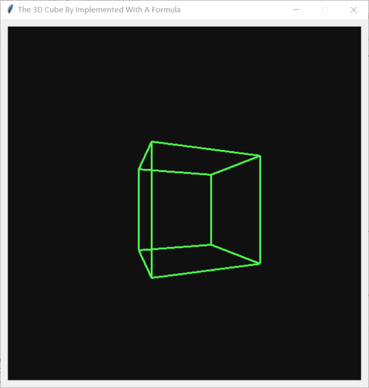
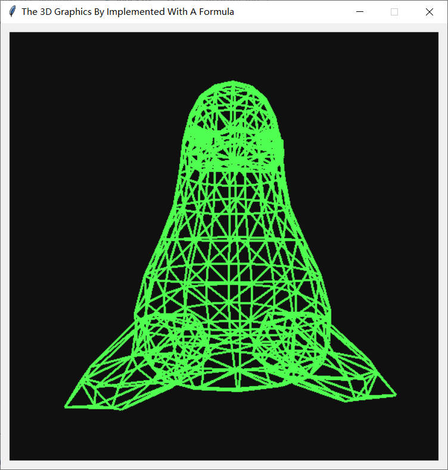

# Use one formula that demystifies 3D graphics and impelment with python tkinter

## Reference

The Reference Code: https://github.com/tsoding/formula<br/>
The Reference Youtube Video: https://www.youtube.com/watch?v=qjWkNZ0SXfo

## Quick Start

```console
$ git clone https://github.com/williams685/formula
$ cd formula
$ python index.py
```

## Screenshots





## Model

The model is provided by [https://github.com/Max-Kawula/penger-obj](https://github.com/Max-Kawula/penger-obj)

[](https://github.com/Max-Kawula/penger-obj)
